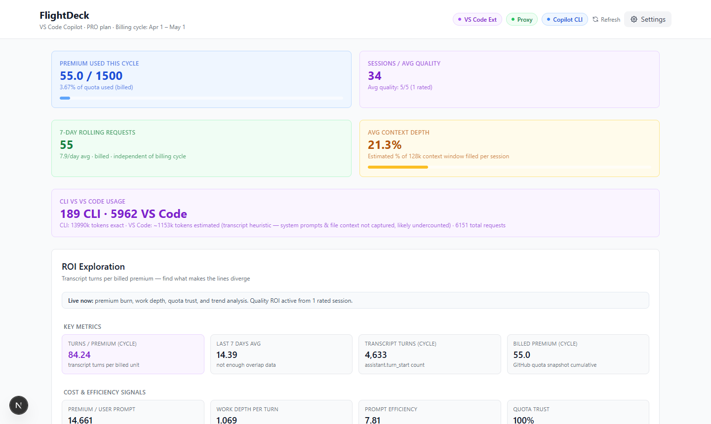
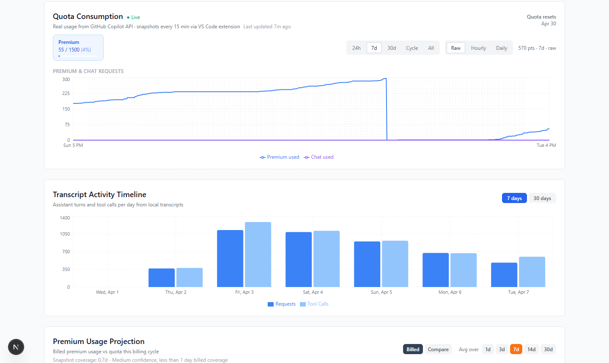
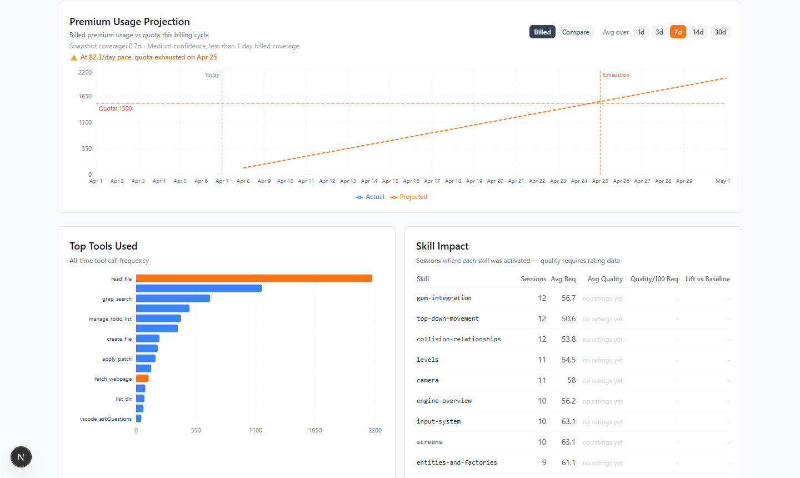
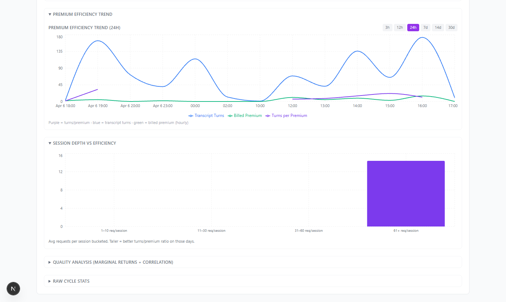
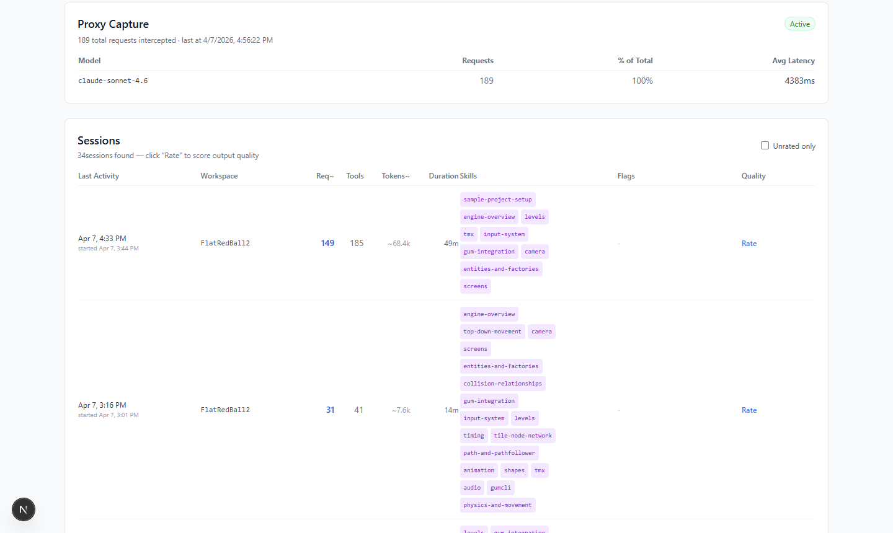

# FlightDeck

Local Copilot analytics for people who care about output quality, workflow efficiency, and premium quota burn.

Runs fully on your machine. No external database, no hosted telemetry, no cloud lock-in.



## Why This Exists

Raw Copilot usage counts are not enough. FlightDeck answers practical questions:

- How quickly am I burning premium quota this billing cycle?
- Which tools and skills produce the most output per request?
- Are my sessions getting more or less efficient over time?
- Did a plan upgrade or quota reset break my projections?

## Data Sources

FlightDeck combines two local sources that measure different things:

| Source | What it captures | How |
|--------|-----------------|-----|
| VS Code transcripts | Session activity, tool calls, skill usage, turn counts | Read from `%APPDATA%\Code\User\workspaceStorage\` automatically |
| Quota snapshots | Billed premium usage direct from GitHub Copilot API | VS Code companion extension polls every 15 min |

Transcript counts and billed quota are tracked separately on purpose. When they diverge, that is signal.

## Screenshots

### Quota Consumption + Transcript Activity

Real billed usage from the GitHub Copilot API. Pills and time filters on one row. The sharp drop visible in the 7d raw view is a quota reset from a Pro → Pro+ plan upgrade — FlightDeck detects this automatically and adjusts projections accordingly.



### Premium Usage Projection

Burn rate calculated from post-reset snapshots only when a plan upgrade is detected mid-cycle. Dashed line shows projected exhaustion date at current pace.



### Premium Efficiency Trend

Transcript turns per billed premium unit over time, with 7-day moving average. The best view for spotting whether your workflow is getting more or less efficient. Switchable from 3h to 30d; sub-day mode switches to hourly granularity.



### Proxy Capture + Session List

MITM proxy intercepts CLI API calls for exact token counts and latency per model. Sessions list shows per-session skill tags, tool call counts, estimated tokens, and quality ratings.



## Quick Start

```bash
npm install
npm run dev
```

Open `http://localhost:3000`.

Transcript data is read automatically. For billed quota data, install the VS Code extension (see below).

## Header Status Pills

The header shows live status for all three data pipelines:

- **VS Code Ext** — green when a quota snapshot arrived within the last 30 minutes
- **Proxy** — green when the MITM proxy log has recent CLI captures
- **Copilot CLI** — blue when the CLI tool is detected

## Key Metrics

### KPI Cards

| Card | What it measures |
|------|-----------------|
| Premium Used This Cycle | Billed `premiumUsed` from quota snapshots vs. your plan limit |
| 7-Day Rolling Requests | Delta from quota time series over the last 7 days (billed, not estimated) |
| Sessions / Avg Quality | Session count from transcripts + average of your manual quality ratings |
| Avg Context Depth | Estimated % of the 128k context window used per session |
| CLI vs VS Code Usage | Request split between CLI proxy captures and VS Code transcript sessions, with token volumes. Note: VS Code token counts are transcript heuristic estimates — system prompts and file context are not captured, so VS Code tokens are likely undercounted. |

### Quota Consumption

Live chart of billed `premiumUsed` over time, pulled directly from the GitHub Copilot quota API via the extension. Supports 24h / 7d / 30d / cycle / all time windows and raw / hourly / daily granularity.

**Plan upgrade detection:** if `premiumUsed` drops by more than 30 units and 40% between two snapshots, FlightDeck recognises a quota reset (GitHub resets the counter on plan upgrades) and slices the time series to post-reset only. Burn rate, projections, and 7-day rolling counts all use post-reset data automatically.

### Premium Usage Projection

Projects quota exhaustion based on recent burn rate. Burn rate is computed from the rolling window of post-reset snapshots. When there is less than one day of post-reset coverage, falls back to a cycle-average calculation.

### Premium Efficiency Trend

Transcript turns divided by billed premium units per time window. Higher = more output per billed request. The 7-day moving average smooths day-to-day noise. Use this to spot whether workflow changes (new skills, different tools, longer sessions) are moving efficiency up or down.

### ROI Exploration Panel

- Turns/premium, work depth per turn, prompt efficiency, quota trust score
- Session depth vs efficiency scatter (bucketed by req/session)
- Top skills by quality efficiency (requires rated sessions)
- Skill impact table — avg requests and quality per skill

### Proxy Capture

The MITM proxy intercepts CLI API traffic for exact token counts and model latency. Shows model breakdown with request count, % of total, and avg latency. VS Code chat uses its own internal OAuth flow and does not go through the proxy — VS Code activity is tracked via transcripts instead.

### Sessions List

All parsed transcript sessions with: workspace name, request count, tool call count, estimated tokens, duration, detected skills, and quality rating (1–5, click to rate).

## Extension Setup

The VS Code extension polls the GitHub Copilot quota API and writes snapshots locally.

1. Build from `vscode-extension/`:

```bash
npm install
npm run compile
npm run package
```

2. Install the `.vsix` in VS Code: Extensions view → `...` menu → Install from VSIX → `copilot-telemetry-collector-1.0.0.vsix`

3. Reload VS Code (`Developer: Reload Window`).

4. Verify: status bar shows a graph icon with a percentage. Run `Copilot Telemetry: Refresh Now` to trigger an immediate snapshot.

The extension writes to:

```text
%APPDATA%\copilot-telemetry\snapshots.jsonl
```

And optionally POSTs to `http://localhost:3000/api/quota-snapshots`.

## MITM Proxy Setup (CLI Capture)

The MITM proxy intercepts Copilot API traffic to capture **exact token counts and latency** for CLI sessions. Without it, CLI usage (`gh copilot`, multi-agent runs) is completely invisible to FlightDeck — VS Code is tracked via transcripts, but CLI writes no transcripts.

**One-time setup:**

```powershell
pip install mitmproxy
mitmdump --listen-port 8877   # Ctrl+C after a second (generates CA keys)
# Then trust %USERPROFILE%\.mitmproxy\mitmproxy-ca-cert.p12 in
# Trusted Root Certification Authorities
```

**Start the proxy:**

```powershell
.\scripts\Start-CopilotProxy.ps1
```

This starts `mitmdump` in the background and sets `HTTPS_PROXY` at the Windows User environment scope so all terminals route Copilot traffic through the proxy automatically.

**What it enables in the dashboard:**

- **Proxy status pill** — green when captures arrived in the last 24h
- **Exact token counts** — prompt, completion, and total tokens per request
- **CLI vs VS Code split** — KPI card breaks down request volume by source
- **Proxy Capture panel** — per-model request counts and avg latency

See [docs/proxy-setup.md](docs/proxy-setup.md) for full setup, troubleshooting, and uninstall instructions.

## Repo Layout

```
src/app/          Next.js app router + API routes
src/components/   Dashboard panels and charts
src/lib/          Parsers, stats engine, DB layer
vscode-extension/ Companion extension
docs/             Design notes, metric definitions
scripts/          Dev utilities (screenshots, etc.)
```

## API Endpoints

| Method | Path | Description |
|--------|------|-------------|
| GET | `/api/stats` | Aggregated metrics for all cards and charts |
| GET | `/api/sessions` | Parsed session list |
| POST | `/api/sessions/[id]/rate` | Persist quality rating |
| GET | `/api/quota-snapshots` | Quota time series + latest snapshot |
| POST | `/api/quota-snapshots` | Ingest snapshot from extension |
| GET/PUT | `/api/config` | Local dashboard config (plan, settings) |

## Local Storage

```text
~\.ai-usage\data.json                           Dashboard config and session ratings
%APPDATA%\copilot-telemetry\snapshots.jsonl     Extension quota snapshots
~\.ai-usage\proxy-requests.jsonl                MITM proxy CLI captures
```

## Notes

- Browser extensions that mutate HTML (e.g. Dark Reader) can trigger dev-only hydration warnings. Safe to ignore.
- `next lint` is broken in this project — use `npx eslint .` directly.
- Tests: `npx vitest run` (174 tests).

## Docs

- [docs/DESIGN.md](docs/DESIGN.md)
- [docs/DATA_POINTS.md](docs/DATA_POINTS.md)
- [docs/EXTENSION_PLAN.md](docs/EXTENSION_PLAN.md)
- [docs/MONITORING.md](docs/MONITORING.md)
