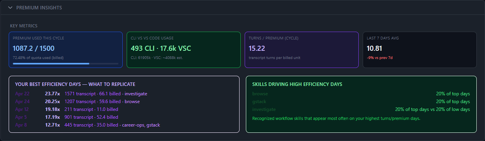
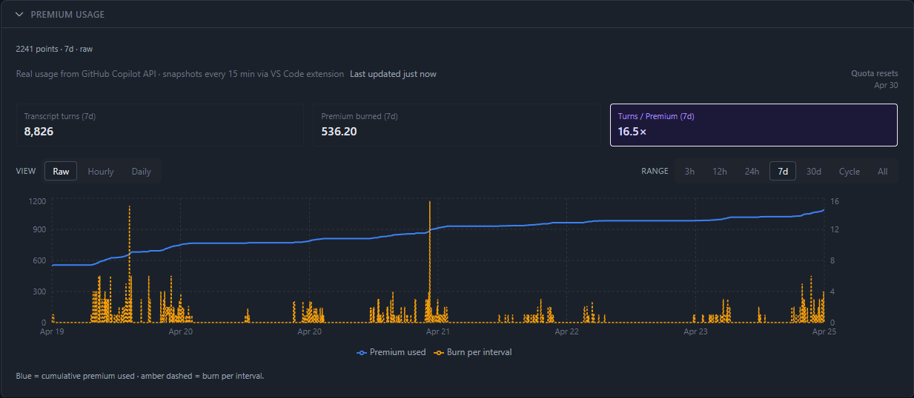
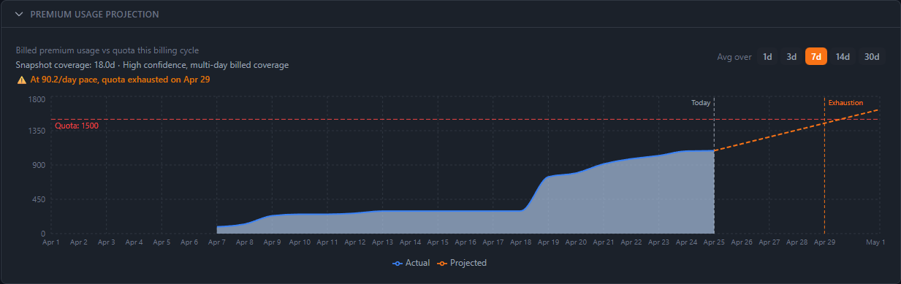
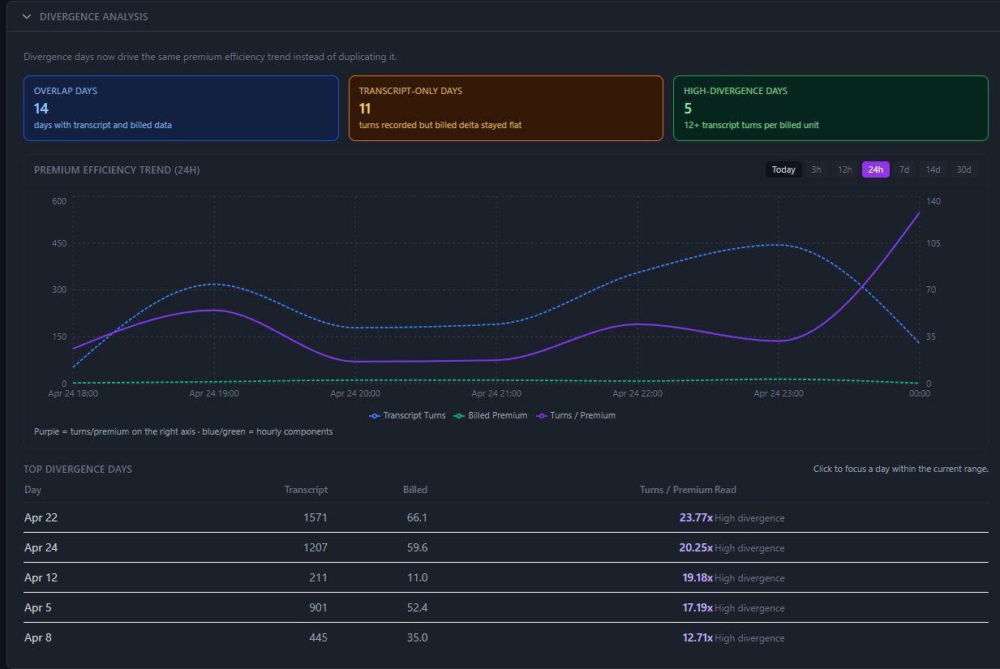
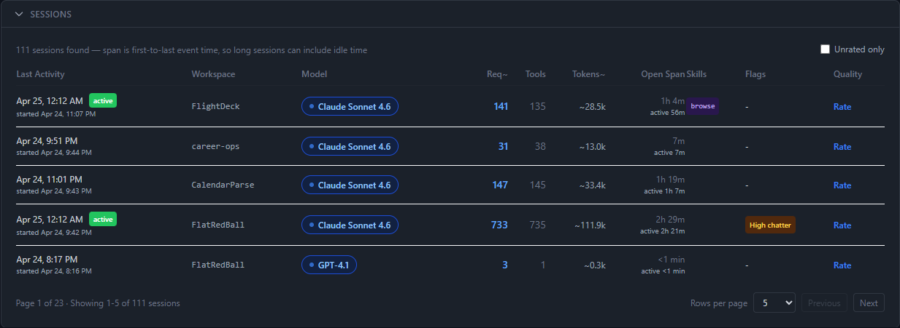
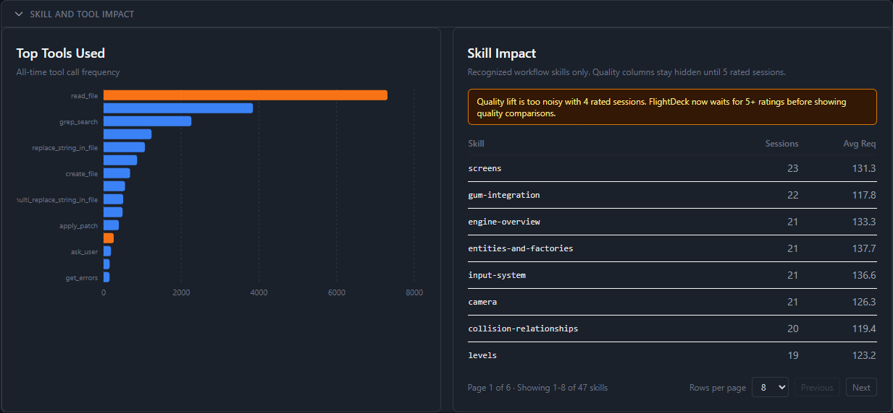
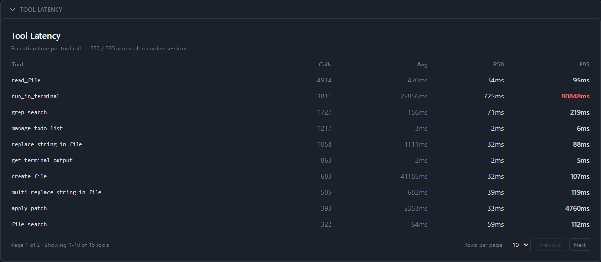
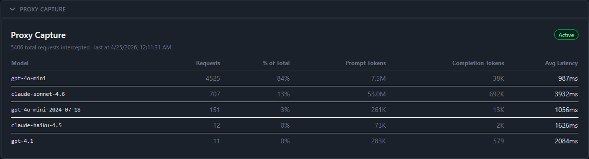
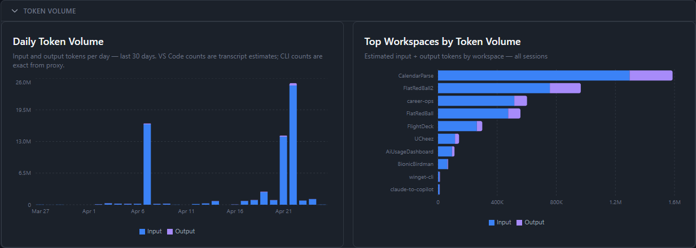

# FlightDeck

Local analytics for GitHub Copilot power users. Tracks quota burn, session efficiency, skill impact, and tool latency, entirely on your machine.

No external database. No hosted telemetry. No cloud lock-in.



## Why This Exists

Raw Copilot usage counts tell you how much you used it, not whether it was worth it. FlightDeck answers the questions that matter:

- How fast am I burning premium quota this billing cycle, and when will it run out?
- Which skills and tools produce the most transcript turns per billed unit?
- Are my sessions getting more or less efficient over time?
- How does my CLI usage compare to VS Code usage, by token volume and request count?
- Which models hit rate limits, and how often?

## Features

- **Quota burn tracking**: live chart of billed `premiumUsed` from the Copilot API, with automatic plan-upgrade detection
- **Quota exhaustion projection**: burn rate from recent snapshots, with confidence rating based on coverage depth
- **Divergence analysis**: compares transcript turns vs. billed premium per day; flags high-divergence days
- **Efficiency trend**: turns/premium ratio over time, switchable from 3h to 30d with moving average
- **Best efficiency days**: surfaces the days with your highest turns/premium and the skills present on those days
- **Session list**: all parsed transcript sessions with model, tool call count, estimated tokens, detected skills, and quality ratings
- **Skill impact table**: avg requests and sessions per recognized workflow skill
- **Tool breakdown**: all-time tool call frequency and P50/P95 latency per tool
- **Proxy capture**: MITM proxy intercepts CLI API traffic for exact token counts and model latency
- **Token volume**: daily input/output token chart + per-workspace breakdown
- **Rate limit events**: automatic detection of 429 and context overflow errors, deduplicated with occurrence counts
- **Dark mode**: full dark theme with system preference detection and persistent toggle

## Screenshots

### Quota Consumption

Real billed usage from the GitHub Copilot API, polled every 15 minutes by the VS Code extension. Blue line is cumulative `premiumUsed`; amber bars are burn per interval. Time range and granularity are independently switchable. When a plan upgrade resets the counter mid-cycle, FlightDeck detects it automatically and trims to post-reset data.



### Quota Exhaustion Projection

Projects when the current billing cycle runs out based on recent burn rate. Confidence rating reflects how many days of post-reset snapshots are available. Orange dashed line shows the projected exhaustion date.



### Divergence Analysis + Efficiency Trend

Compares transcript activity against billed premium per day. Overlap days (both sources present), transcript-only days, and high-divergence days are called out separately. The efficiency trend chart shows turns/premium over the selected range.



### Session List

All sessions parsed from VS Code transcript files. Columns: workspace, model (with color-coded badge), request count, tool calls, estimated tokens, open span with detected skills, flags (High chatter, etc.), and quality rating. Sessions currently in progress get a green `active` badge.



### Skill and Tool Impact

Left: all-time tool call frequency ranked by volume. Right: recognized workflow skills with session count and avg requests per session. Quality columns unlock after 5 rated sessions.



### Tool Latency

Execution time per tool call type, with P50 and P95 across all recorded sessions. Useful for spotting which tools are responsible for slow sessions.



### Proxy Capture

MITM proxy intercepts Copilot CLI API traffic for exact token counts and latency. Shows per-model breakdown: request count, share of total, prompt tokens, completion tokens, and avg latency. VS Code chat uses its own OAuth flow and does not route through the proxy; it is tracked via transcripts instead.



### Token Volume

Daily input/output token chart for the last 30 days, plus a per-workspace breakdown of all-time token consumption. VS Code token counts are transcript heuristic estimates; CLI counts are exact from the proxy.



## Tech Stack

| Layer | Technology |
|-------|-----------|
| Framework | [Next.js 16](https://nextjs.org/) (App Router, `"use client"`) |
| Language | TypeScript 5, strict mode |
| Styling | Tailwind CSS 3: `darkMode: "class"` with full dark palette |
| Charts | [Recharts](https://recharts.org/) 2 |
| Database | SQLite via [better-sqlite3](https://github.com/WiseLibs/better-sqlite3): local `~/.ai-usage/sessions.db` |
| Testing | Vitest + Testing Library |
| Extension | VS Code extension (TypeScript): polls Copilot quota API every 15 min |
| Proxy | [mitmproxy](https://mitmproxy.org/): intercepts CLI HTTPS traffic |

Everything runs locally. The only network calls are the ones your Copilot tools already make.

## Quick Start

```bash
npm install
npm run dev
```

Open `http://localhost:3000`. Transcript data is read automatically from VS Code's local storage.

For billed quota data, install the VS Code extension (see below). For CLI token counts, set up the MITM proxy.

## Data Sources

FlightDeck combines three independent sources:

| Source | What it captures | Setup |
|--------|-----------------|-------|
| VS Code transcripts | Session activity, tool calls, skill tags, turn counts | Automatic; read from `%APPDATA%\Code\User\workspaceStorage\` |
| Quota snapshots | Billed `premiumUsed` direct from the GitHub Copilot API | VS Code extension (polls every 15 min) |
| MITM proxy | Exact token counts, model, and latency for CLI requests | One-time proxy + cert setup |

Transcript activity and billed quota are tracked separately on purpose. Divergence between the two is a signal in its own right. FlightDeck surfaces it explicitly in the Divergence Analysis panel.

## Header Status Pills

The header shows live pipeline status:

- **VS Code Ext** — green when a quota snapshot arrived within the last 30 minutes
- **Proxy** — green when the proxy log has recent CLI captures (last 24 h)
- **Copilot CLI** — dot indicator when the CLI tool is detected on the system

## Extension Setup

The VS Code extension polls the Copilot quota API and writes snapshots locally.

**Build and install:**

```bash
cd vscode-extension
npm install
npm run compile
npm run package
```

In VS Code: Extensions → `...` → Install from VSIX → `copilot-telemetry-collector-1.0.0.vsix`, then reload.

The status bar shows a graph icon with your current usage percentage. Run **Copilot Telemetry: Refresh Now** from the command palette to force an immediate snapshot.

Snapshots are written to:

```
%APPDATA%\copilot-telemetry\snapshots.jsonl
```

## MITM Proxy Setup (CLI Capture)

The MITM proxy intercepts Copilot CLI API traffic for exact token counts and latency. Without it, CLI usage (`gh copilot`, multi-agent runs, Codex CLI) is invisible to FlightDeck.

**One-time setup:**

```powershell
pip install mitmproxy
mitmdump --listen-port 8877   # run once to generate CA keys, then Ctrl+C
# Trust %USERPROFILE%\.mitmproxy\mitmproxy-ca-cert.p12
# in Windows: Trusted Root Certification Authorities
```

**Start / stop:**

```powershell
.\scripts\Start-CopilotProxy.ps1   # starts mitmdump + sets HTTPS_PROXY user env var
.\scripts\Remove-CopilotProxy.ps1  # stops proxy + clears env var
```

See [docs/PROXY_SETUP.md](docs/PROXY_SETUP.md) for full setup, troubleshooting, and uninstall instructions.

## Contributing

This is a personal tool built for a specific workflow. PRs for bugs or well-scoped improvements are welcome. Open an issue first for anything larger than a single-panel fix.

```bash
npm test          # run Vitest suite
npx tsc --noEmit  # type check
npx eslint .      # lint
```

## Local Storage

```text
~\.ai-usage\data.json                           Dashboard config and session ratings
%APPDATA%\copilot-telemetry\snapshots.jsonl     Extension quota snapshots
~\.ai-usage\proxy-requests.jsonl                MITM proxy CLI captures
```

## Notes

- Browser extensions that mutate HTML (e.g. Dark Reader) can trigger dev-only hydration warnings. Safe to ignore.
- `next lint` is broken in this project — use `npx eslint .` directly.
- Tests: `npx vitest run` (174 tests).

## Docs

- [docs/DATA_POINTS.md](docs/DATA_POINTS.md)
- [docs/MONITORING.md](docs/MONITORING.md)
- [docs/PROXY_SETUP.md](docs/PROXY_SETUP.md)
- [docs/MODEL_LIMITS.md](docs/MODEL_LIMITS.md)
